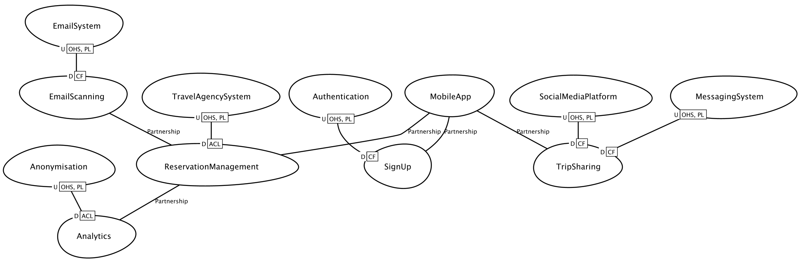
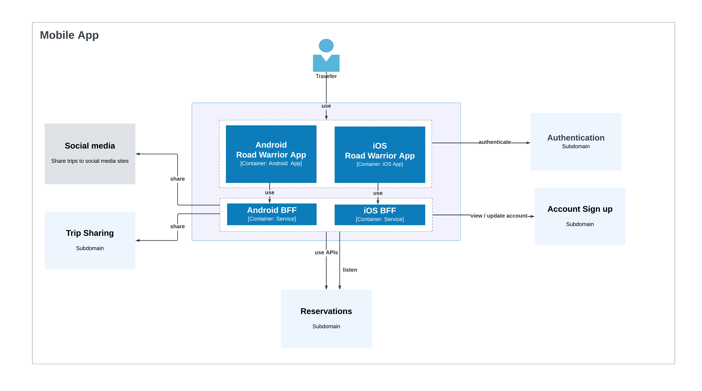

# Kaizen Crew's O'Reilly Architectural Kata 2023

## Contents

* [Business Context](#business-context)
* [Requirements](#requirements)
    * [Functional Requirements](#functional-requirements)
    * [Cross-Functional Requirements](#cross-functional-requirements)
* [Architecture](#architecture)
    * [Architectural Principles](#architectural-principals)
    * [Components](#components)
    * [Context Map](#context-map)
    * [Architecture Decision Records](#architecture-decision-records)
    * [Domains and Subdomains](#domains-and-subdomains)
    * [Strategic Design Decisions](#strategic-design-decisions)

## Business Context

Road Warrior is a next generation online reservation management dashboard and mobile app. 

It gathers information about upcoming flights, hotel reservations and car rentals for you to create a detailed trip itenerary and see information about all of your trips and reservations in one place. It can scan your inbox for travel-related emails and automatically add new reservations for you to add to upcoming trips. 

Road Warrior will automatically detect and notify you about changes to upcoming bookings and reservations (delays, cancellations, gate changes) and can connect you with the travel agency to get help and quickly resolve issues.

You can share information about your trips with friends and family in Road Warrior to let them know where and when you are travalling.

## Requirements

### Functional Requirements

#### Sign Up

* Users must sign up with an email account
* Users can connect Road Warrior to one or more email accounts to automatically find upcoming reservations

#### Reservations

* The system can automatically search emails for upcoming travel, hotel and car rental reservations from selected travel agencies
* Users can view information about upcoming reservations
* Users can add, update and remove reservations manually
* Users can forward reservation emails to RoadWarrior to add to their account
* The system gets updates about reservations from travel agencies (as they happen) 
* The system reminds travellers about upcoming reservations
* The system notifies travellers about changes to their reservations

#### Upcoming Trips

* Users can group reversations into trips
* Users can view trip itineraries
* Users can share trip information via email, messaging and Social Media platforms

#### Trip Metrics

* The system sends an annual trip summary to the account holder

#### Getting Help

* Users can contact their preferred travel agent for help with their reservations

#### Account Management

* Users can switch email scanning on/off
* Users can add, update or remove a preferred travel agency for getting help

### Cross-Functional Requirements

* **Scalability** - 15 million registered users. 2 million weekly active users. Each user may have any number of trips or reservations.
* **Availability** - 99.98% service availability (no more than 5 mins per month unplanned downtime).
* **Performance** - 300ms response time on web and First Contentful Paint in under 1.4s in the mobile app.
* **Data consistency** - Updates to reservations must appear in the app within 5 minutes of receipt.
* **Ease of use** - User experience is paramount. Road Warrior must be intuitive and easy to use.
* **Internationalisation and localisation** - the app must be location- and timezone-aware, work for users in any location and be capable of supporting multiple languages. 

## Architecture

### Architectural Principals

* **Cloud native** - design Road Warrior to take full advantage of the cloud. Adopt cloud-native services where they offer competitive or significant cost advantage but beware lock-in and ensure applications and services are sufficiently isolated and portable where possible.
* **Automate everything** - automate all simple repetitive tasks and build Road Warrior with automation in mind at the outset - builds, deployments, testing, monitoring and alerting should all be automated.
* **Design for scale** - disaggregate systems, organisation and processes to allow for limitless scale, and benefit from elasticity and auto-scaling features of the cloud. Favour asynchronous design to increase tolerance for bottlenecks in communication between systems.
* **Isolate faults** – build-in circuit breakers to ensure a failure of one service does not affect multiple other services. Segment customers to minimise the blast radius of failures.
* **Be the early majority, not an early adopter** - use mature, proven technologies for critical systems whenever availability and reliability are important. Be cautious around new technologies, implement them for features less critical to the operation and availability of the service, product or platform and then adopt them when you have proven they are reliable at scale and durable.
* **APIs are potential products** – design APIs as though they are products. Understand needs of the customer, focus on the user experience and make them easy to use regardless of whether the consumer is external or an internal system or developer.
* **Design for observability** – design Road Warrior to be easily observed and help us identify potential or future issues, candidates for architectural changes and to understand usage patterns.
* **Zero-downtime deployments** - design to allow changes to be deployed or rolled back while Road Warrior is still live.
* **Secure by design** - security should be built in from the ground up and considered at the earliest stages of the development process rather than as an afterthought.

### Components

### Context Map

### Domains and Subdomains

Road Warrior's business domain is travel. 

Its primary competetive advantage will be its ability to aggregate travellers' flights, hotel reservations and car rentals and then gather updates to reservations from a wide range of travel agencies in near real-time.

Mobile app user experience will also set Road Warrior apart from its competitors.

Trip analysis will provide insight into travellers' habits, behaviours and preferences and could become a future revenue stream. Aggregating travel data from multiple sources could give Road Warrior a competetive advantage if it develops the capability to harness it.

#### Core Subdomains

* Reservation management
* Mobile app
* Analysis

#### Generic Subdomains

* Authentication

#### Supporting Subdomains

* Sign up
* Email scanning
* Data anonymisation
* Trip sharing

### Strategic Design Decisions

* Reservation management, analysis and Road Warrior's mobile and web apps have to be be implemented in-house.
* Authentication should delegated to the service hosting the users email account or implemented using off-the-shelf or open source solutions.
* Signing up, email scanning, data anonymisation and integration with messaging and social media platforms can be outsourced. 

### Architecture Decision Records

* [ADR 1: Event-Driven Microservices Architecture for Reservations](decisions/ADR-1%20Event-Driven%20Microservices%20Architecture%20for%20Reservations.md)
* [ADR 2: Micro Frontends](decisions/ADR-2%20Micro%20Frontends.md)
* [ADR 3: Cloud Content Delivery Network at the Edge](decisions/ADR-3%20Cloud%20Content%20Delivery%20Network%20at%20the%20Edge.md)
* [ADR 4: Geo-replication for Trips and Reservations](decisions/ADR-4%20Geo-replication%20for%20Trips%20and%20Reservations.md)
* [ADR 5: Key Vault for Secrets and Credentials](decisions/ADR-5%20Key%20Vault%20for%20Secrets%20and%20Credentials.md)
* [ADR 6: Native Android and iOS Apps](decisions/ADR-6%20Native%20Android%20and%20iOS%20Apps.md)
* [ADR 7: Backends for Frontends for Android and iOS Apps](decisions/ADR-7%20Backends%20for%20Frontends%20for%20Android%20and%20iOS%20Apps.md)
* [ADR 8: Pipes and Filters Architecture for Analytics](decisions/ADR-8%20Pipes%20and%20Filters%20Architecture%20for%20Analytics.md)

### Architecture Diagrams

#### Mobile app

##### Capability 
* Deliver a rich UX
* Initiating trip sharing and account sign up
* Communicate with reservations via Backend-to-Frontend

##### Architectural Characteristics
* Usability and User Experience
* Performance
* Localisation and internationalisation

#### Reservation management

##### Architectural Characteristics
* Availability
* Performance
* Scalability

#### Analytics

##### Architectural Characteristics
* Reliability
* Cost
* Learnability

### Supporting and Generic Subdomains
